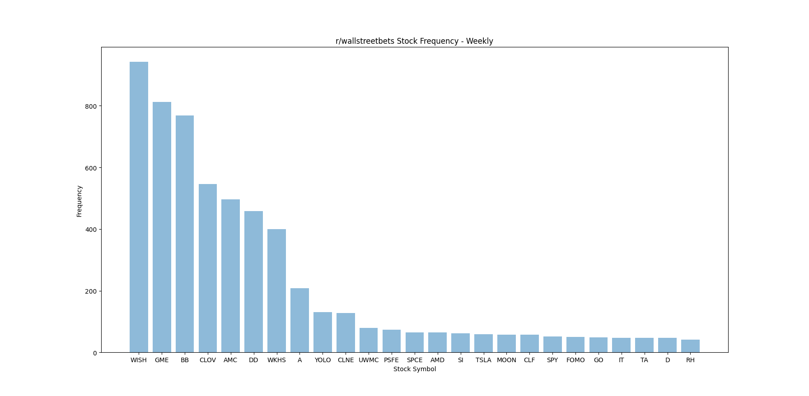
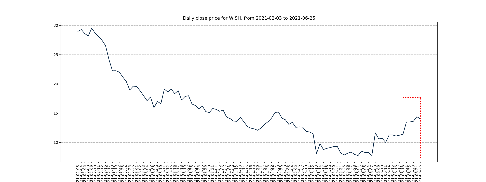

# r/wallstreetbets Ticker Price Correlation
wsb is 
## Example
1. Generate a frequency graph of the top 25 stocks that were included in reddit and subreddit posts in a week. WISH was the most appeared stock from June 21, 2021 to June 25, 2021 in r/wallstreetbets.

2. During June 21, 2021 to June 25, 2021 where WISH appeared more than any other stock, WISH has increased in price. 

## Dependencies
- [Pandas](https://pandas.pydata.org/)
- [Praw](https://praw.readthedocs.io/en/latest/#)
- [Numpy](https://numpy.org/)
- [Matplotlib](https://matplotlib.org/)
- [Alpha Vantage](https://www.alphavantage.co/)

## Reddit Application API
Change value of ```client_id:```, ```client_secret:```, ```user_agent:```, ```username:``` and ```password:```.
```
reddit_application = praw.Reddit(client_id='GENERAL API KEY', 
                         client_secret='SECRET API KEY', 
                         user_agent='APPLICATION NAME', 
                         username='REDDIT ACCOUNT USERNAME', 
                         password='REDDIT ACCOUNT PASSWORD')
```

## Alpha Vantage API
Change value of ```key:``` and ```symbol:```.
```
config = {
    "alpha_vantage": {
        "key": "ALPHA VANTAGE API KEY", 
        "symbol": "STOCK TICKER", 
        "outputsize": "compact", 
        "key_adjusted_close": "5. adjusted close",
    }, 

    ...
}

```

## TODO
- Sentiment analysis 
